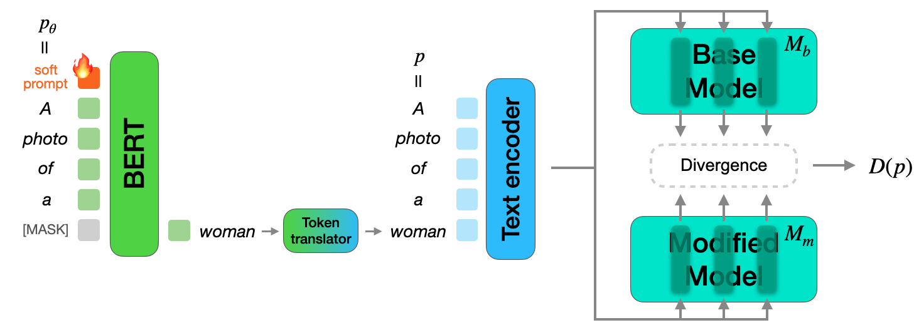

# DriftScope: Measuring The Hidden Effects of Diffusion Model Adaptation

> Accepted at European Conference on Computer Vision 2026 🎉

[Héctor Laria](https://orcid.org/0009-0008-6253-4709)<sup>*1,2</sup>, [Yiping Han](https://orcid.org/0009-0007-2589-576X)<sup>*1,2</sup>, [Julian D. Santamaria](https://orcid.org/0009-0007-7287-5761)<sup>1,2</sup>, [Kai Wang](https://orcid.org/0000-0002-9605-8279)<sup>3,4</sup>, [Bogdan Raducanu](https://orcid.org/0000-0003-3648-8020)<sup>1,2</sup>, [Joost van de Weijer](https://orcid.org/0000-0002-9656-9706)<sup>1,2</sup>, [Alexandra Gomez-Villa](https://orcid.org/0000-0003-0469-3425)<sup>1,2</sup>

<sup>1</sup> Computer Vision Center (CVC), Barcelona, Spain &nbsp; <sup>2</sup> Universitat Autònoma de Barcelona, Barcelona, Spain
<sup>3</sup> City University of Hong Kong (Dongguan), China &nbsp; <sup>4</sup> City University of Hong Kong, China

[](https://) [](https://)



## Abstract

Adapting pre-trained text-to-image diffusion models, whether to learn new visual concepts or erase unwanted ones, is routinely evaluated on its intended effects alone. We argue this framing is incomplete. Through sparse autoencoder analysis and zero-shot classification, we demonstrate that adaptation systematically damages semantically unrelated concepts in ways that aggregate metrics structurally cannot surface: when damage is severe enough for FID and KID to respond, the model is already nearly unusable; when the model remains functional, FID and KID stay flat while specific classes silently suffer worst-case zero-shot accuracy drops of up to 18.9 points and concept-level distributions shift dramatically. This pattern appears at both ends of the adaptation spectrum (concept customization and concept unlearning), suggesting it is a systematic consequence of weight-level modification rather than an artifact of any particular method. To surface this hidden drift before deployment, we introduce DriftScope, a prompt-level diagnostic tool that takes any two model checkpoints and returns a ranked list of tokens whose visual concepts have shifted most between them. DriftScope optimizes a soft prompt to attribute drift at the token level without requiring access to real data or model internals. The result is an interpretable, concept-level audit that aggregate evaluation cannot provide.

## Results


## Repository structure

The code is split into two versions by base-model architecture:

| Version | Architectures |
|---------|--------------------------------|
| `v1/`   | SD 1.4, SD 1.5, SD 2.1         |
| `v2/`   | SD 3.5-Medium (+ SDXL notebooks) |

```
DriftScope/
├── v1/                         # SD 1.4 / 1.5 / 2.1
│   ├── dexter/                 
│   ├── notebooks/              
│   ├── checkpoints/            # (created by setup) precomputed translation matrices
│   ├── outputs/                # drift reports written here
│   ├── run_several.py          # runner
│   └── run_several.sh          # launch script
├── v2/                         # SD 3.5-Medium
│   ├── dexter/                 
│   ├── notebooks/              
│   ├── requirements.txt
│   ├── run_sd35.py             # runner
│   └── run_sd35m.sh            # launch script
└── diffusion_modified_models/  # adapted checkpoints to audit
```


## Setup

### 1. Install dependencies

Requires Python 3.11, PyTorch 2.5.1, and CUDA 12.1.

```bash
pip install -r requirements.txt
```

### 2. Download base models & precompute assets

Run the setup notebook **once** for the version you intend to use, before anything else:

```
v1/notebooks/setup.ipynb      # or v2/notebooks/setup.ipynb
```

This downloads the base diffusion models from the Hugging Face Hub and precomputes the token
**translation matrices** (used to map the masked-LM vocabulary into each diffusion text encoder's
vocabulary) into the `checkpoints/` folder. Doing it once up front avoids redundant work later.

### 3. Provide the adapted checkpoints

DriftScope compares a base model against an **adapted** model that you want to audit. Place those
checkpoints under `diffusion_modified_models/` (this folder ships empty) and update the
`cfg.modified_model` path in the runner for your method.

## Running DriftScope

### A) Systematic runs

```bash
# v1 (SD 1.4 / 1.5 / 2.1)
cd v1
python run_several.py --method db15 --prompt "A photo of a" --out_subfolder sd15 --gradient_checkpointing

# v2 (SD 3.5-Medium)
cd v2
python run_sd35.py --prompt "A photo of a" --out_subfolder sd35m
```

`run_several.py` / `run_sd35.py` call `find_unique_masks()`, which repeats the optimization until it
collects **N distinct high-drift words**.

**v1 `run_several.py` arguments:**

| Argument                   | Default          | Description |
|----------------------------|------------------|-------------|
| `--method`                 | `db15`           | Unlearning: `ac`, `spm`, `sh`; Customization: `db15`, `db21` |
| `--prompt`                 | `A picture of a` | Template prompt; DriftScope optimizes the masked concept token |

`run_sd35.py` (v2) follows the same structure for SD 3.5-Medium.

## Citation

If you find this work useful, please cite:

```bibtex
@article{laria2026driftscope,
  title={DriftScope: Measuring The Hidden Effects of Diffusion Model Adaptation},
  author={Laria, H{\'e}ctor and Han, Yiping and Santamaria, Julian D. and Wang, Kai and Raducanu, Bogdan and Van De Weijer, Joost and Gomez-Villa, Alexandra},
  journal={arXiv preprint arXiv:XXXX.XXXXX},
  year={2026}
}
```


